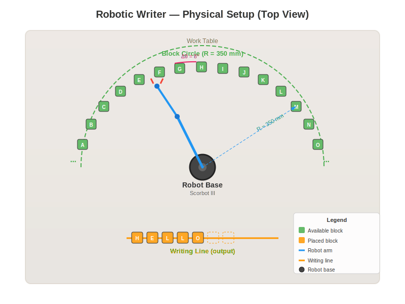
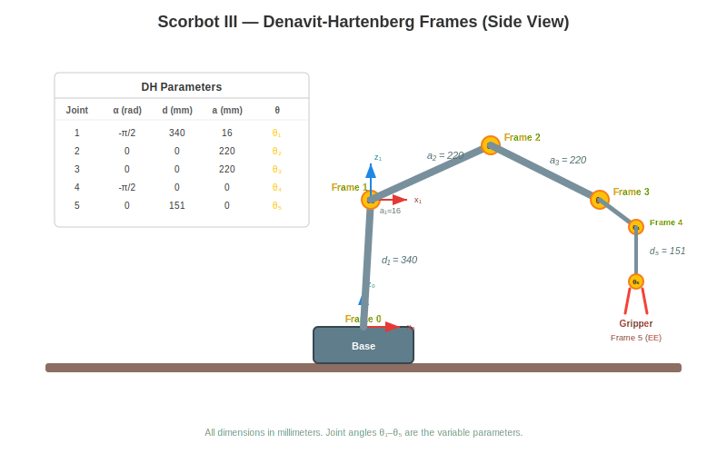
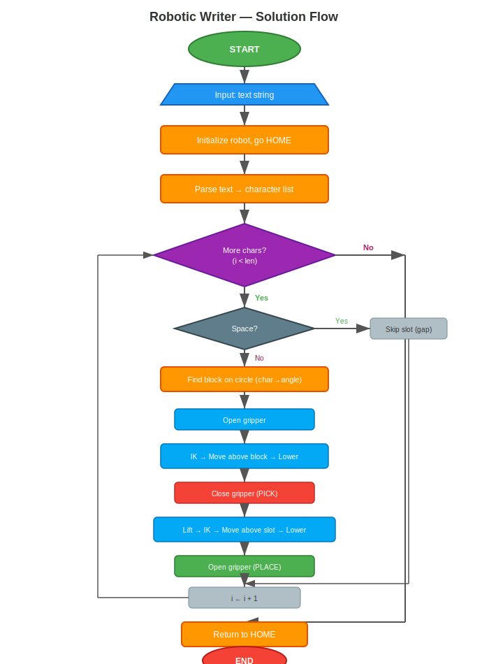
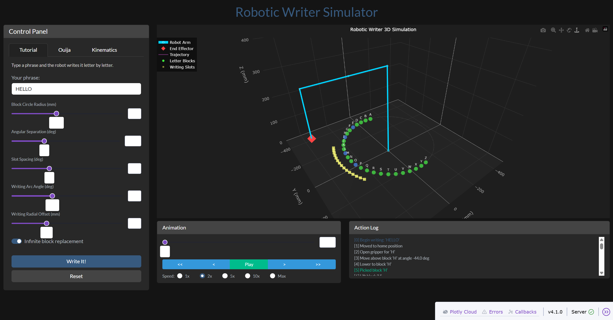
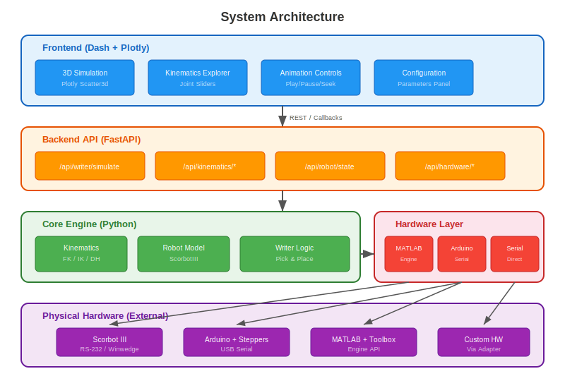

# Robotic Writer

> **Origin**: This project is based on a laboratory activity from the first Automatic Control course (**Control Automatico I**) taken at the **Universidad de Concepcion** (Chile) around **2004**. The original assignment involved programming a Scorbot III robotic arm to pick letter blocks arranged in a circular arc and place them in a line to spell words — a hands-on introduction to robot kinematics, trajectory planning, and serial communication. This modernized version preserves the original concept while providing a full simulation environment, REST API, and support for multiple hardware backends.

---

## Motivation & Problem

Robotic handwriting requires a 5-DOF arm to plan collision-free trajectories for writing text. The challenge involves inverse kinematics, smooth trajectory planning, and gripper coordination for pen-up/pen-down movements.



---

## KPIs & Metrics

| Metric | Target | Current |
|--------|--------|---------|
| Kinematics | Analytical IK (no iterative) | 5-DOF closed-form solution |
| Trajectory | C² continuity option | Cubic (C¹) + quintic (C²) smoothstep |
| Path planning | Collision-free RRT | 1000-iteration RRT with smoothing |
| Writing modes | Block + cursive | Block letters + Bezier cursive (26 chars) |
| Test coverage | Comprehensive | 83 tests passing |

---

## The Problem

A **5-DOF Scorbot III robotic arm** sits at the center of a workspace table. Around it, **26 letter blocks** (A–Z) are arranged on a **circular arc** at a fixed radius from the robot base. Each block occupies a unique angular position, separated by a minimum angular gap to allow the gripper to manipulate them without collisions.

Given an input text string (e.g., `"HELLO"`), the robot must:

1. **Locate** each letter block on the circular arc
2. **Pick** it using inverse kinematics and gripper control
3. **Transport** it to the writing line
4. **Place** it at the next sequential position

The result is the text spelled out physically in a straight line.

### Physical Setup (Top View)

<p align="center">
  
</p>

### Denavit-Hartenberg Frames

<p align="center">
  
</p>

### Kinematics

The robot uses the **Denavit-Hartenberg convention** for kinematic modeling:

#### DH Parameters

| Joint | Name | α (rad) | d (mm) | a (mm) | θ (variable) |
|-------|------|---------|--------|--------|---------------|
| 1 | Base | -π/2 | 340 | 16 | θ₁ |
| 2 | Shoulder | 0 | 0 | 220 | θ₂ |
| 3 | Elbow | 0 | 0 | 220 | θ₃ |
| 4 | Pitch | -π/2 | 0 | 0 | θ₄ |
| 5 | Roll | 0 | 151 | 0 | θ₅ |

#### Forward Kinematics

```
T₀₅ = A₁ · A₂ · A₃ · A₄ · A₅

End-effector position: p = [T₀₅(1,4), T₀₅(2,4), T₀₅(3,4)]ᵀ
```

#### Inverse Kinematics (Analytical)

```
θ₁ = atan2(qy, qx)
θ₃ = arccos((k₁² + k₂² - a₂² - a₃²) / (2·a₂·a₃))
θ₂ = atan2(sin θ₂, cos θ₂)    (from planar geometry)
θ₄ = θ₂₃₄ - θ₂ - θ₃
θ₅ = arcsin(ux·sin θ₁ - uy·cos θ₁)
```

Full derivation: [docs/equations/kinematics.md](docs/equations/kinematics.md)

---

## Solution Flow

<p align="center">
  
</p>

### Key Steps

| Phase | Description |
|-------|-------------|
| **Input** | User enters a text string (up to 50 characters) |
| **Initialization** | Robot homes to known position, block circle and writing line are configured |
| **Character Loop** | For each character: map to block → pick from arc → place on line |
| **Pick Cycle** | Open gripper → move above block → lower → close gripper → lift |
| **Place Cycle** | Move above slot → lower → open gripper → lift |
| **Completion** | Robot returns to home position |

---

## Frontend



<video src="docs/videos/Working_Sim.mp4" controls width="100%"></video>

---

## System Architecture

<p align="center">
  
</p>

### Components

| Layer | Technology | Purpose |
|-------|-----------|---------|
| **Frontend** | Dash + Plotly + Bootstrap | Interactive 3D simulation, kinematics explorer, animation controls |
| **Backend API** | FastAPI + Uvicorn | REST endpoints for simulation, kinematics, hardware control |
| **Core Engine** | NumPy + Python | Forward/Inverse kinematics, trajectory planning, writer logic |
| **Hardware Layer** | pyserial / MATLAB Engine | Adapters for Scorbot III, Arduino steppers, generic serial |

---

## Demo

### Video Demo

[](https://youtu.be/ubUdNsb0W-o)

---

## Features

- Type any text and click **Run Simulation** to see the robot write it
- Use the **Animation** controls to play/pause/seek through the trajectory
- Switch to the **Kinematics** tab to explore forward kinematics interactively
- Adjust block circle radius, angular separation, and spacing
- Multiple hardware backends: MATLAB Engine, Arduino serial, direct Scorbot III serial

---

## Quick Start

### Prerequisites

- **Python 3.12+**
- **Git**

### Installation

```bash
# Clone the repository
git clone https://github.com/your-org/Udec_Robotic_Writer.git
cd Udec_Robotic_Writer

# Create and activate virtual environment
python -m venv .venv

# Windows
.venv\Scripts\activate

# Linux/macOS
source .venv/bin/activate

# Install dependencies
pip install -r requirements.txt
```

### Running the Interactive GUI (Simulation)

```bash
python run_frontend.py
```

Then open **http://localhost:8055** in your browser.

### Running the REST API

```bash
python run_api.py
```

API documentation available at **http://localhost:8005/docs** (Swagger UI).

### Running Both (API + GUI)

Run each in a separate terminal:

```bash
# Terminal 1: API server
python run_api.py

# Terminal 2: GUI
python run_frontend.py
```

### Running Tests

```bash
pip install pytest
pytest tests/ -v
```

---

## Project Structure

```
Udec_Robotic_Writer/
├── README.md                    # This file
├── pyproject.toml               # Python project configuration
├── requirements.txt             # Dependencies
├── run_frontend.py              # Launch the Dash GUI
├── run_api.py                   # Launch the FastAPI server
├── src/
│   ├── core/
│   │   ├── kinematics.py        # DH parameters, FK, IK
│   │   ├── robot.py             # ScorbotIII model, trajectory planning
│   │   └── writer.py            # Block circle, writing line, pick-and-place
│   ├── api/
│   │   └── main.py              # FastAPI REST endpoints
│   ├── hardware/
│   │   ├── base.py              # Abstract hardware adapter interface
│   │   ├── matlab_adapter.py    # MATLAB Engine bridge
│   │   ├── arduino_adapter.py   # Arduino serial protocol
│   │   └── serial_adapter.py    # Direct Scorbot III serial
│   └── frontend/
│       └── app.py               # Dash interactive GUI
├── docs/
│   ├── diagrams/                # SVG diagrams
│   │   ├── robot_setup.svg      # Physical setup (top view)
│   │   ├── dh_frames.svg        # DH reference frames
│   │   ├── solution_flowchart.svg
│   │   └── system_architecture.svg
│   ├── equations/
│   │   └── kinematics.md        # Full mathematical derivation
│   ├── methodology.md           # Problem statement and approach
│   └── arduino_firmware.md      # Arduino protocol and example sketch
├── tests/
│   └── test_kinematics.py       # Unit tests
└── legacy/                      # Original MATLAB code (2004/2007)
    ├── MatlabActual/
    └── leer.m
```

---

## API Documentation

**Key endpoints:**

| Method | Endpoint | Description |
|--------|----------|-------------|
| POST | `/api/writer/simulate` | Run full writing simulation |
| POST | `/api/kinematics/forward` | Compute FK from joint angles |
| POST | `/api/kinematics/inverse` | Compute IK for target position |
| GET | `/api/robot/state` | Get current robot state |
| POST | `/api/hardware/connect` | Connect to hardware adapter |
| GET | `/api/health` | Health check |

### Port

**8005** (API) -- http://localhost:8005 | **8055** (GUI) -- http://localhost:8055

---

## Documentation

| Document | Description |
|----------|-------------|
| [Kinematics Equations](docs/equations/kinematics.md) | Complete mathematical derivation of FK/IK |
| [Methodology](docs/methodology.md) | Problem statement, approach, and system design |
| [Arduino Firmware](docs/arduino_firmware.md) | Protocol specification and example Arduino sketch |
| [DH Frames Diagram](docs/diagrams/dh_frames.svg) | Denavit-Hartenberg reference frames |
| [Setup Diagram](docs/diagrams/robot_setup.svg) | Physical workspace layout |
| [Flowchart](docs/diagrams/solution_flowchart.svg) | Solution algorithm flow |
| [Architecture](docs/diagrams/system_architecture.svg) | System component diagram |

---

## Hardware Integration

### MATLAB (for legacy Scorbot III)

Requires MATLAB installed with the Engine API for Python:

```bash
pip install matlabengine
```

```python
from src.hardware import MatlabAdapter

adapter = MatlabAdapter()
adapter.connect()
adapter.move_motor(1, 500)   # Rotate base 500 steps
adapter.disconnect()
```

### Arduino (stepper motors)

Requires an Arduino running the compatible firmware (see [docs/arduino_firmware.md](docs/arduino_firmware.md)):

```bash
pip install pyserial
```

```python
from src.hardware import ArduinoAdapter

adapter = ArduinoAdapter()
adapter.connect(port="COM3", baud=115200)
adapter.move_motor(1, 500)
adapter.disconnect()
```

### Direct Serial (Scorbot III protocol)

```python
from src.hardware import SerialAdapter

adapter = SerialAdapter()
adapter.connect(port="COM1", baud=9600)
adapter.move_motor(1, 500)
adapter.disconnect()
```

---

## License

MIT License. See original MATLAB code in `legacy/` for historical reference.
