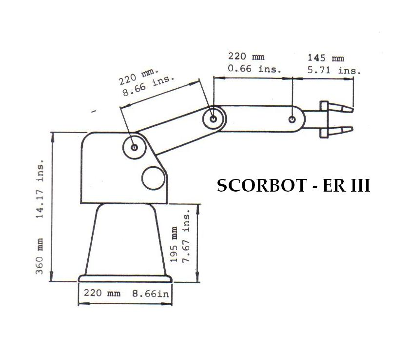
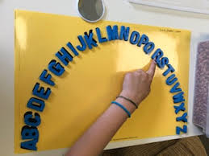
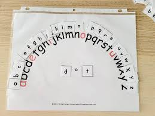

# Backup of Undergraduated project to Control Arm Robot

A simple Matlab Script to use a Arm Robot to understand inverse and direct kinematic problem in robotics. 

## Topic

Just a simple script to use the available arm robot to write words letter by letter

## Target

### Alphabet blocks

Define an arc distant to operate the arm robot where to place the blocks

### Blocks on the arc

The blocks for each letter must be placed on an arc near to the arm robot

### Writting process

User provides a word, the robot takes the blocks and recreate the word

